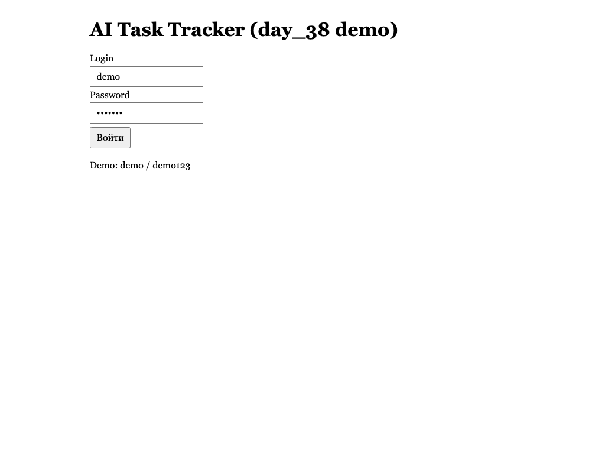
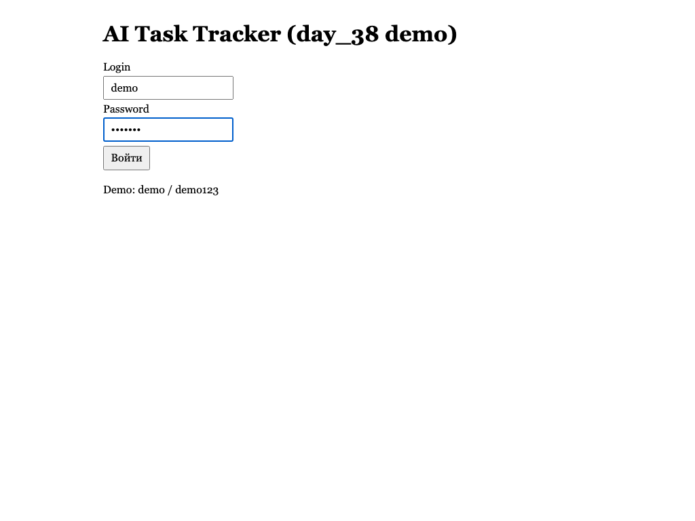
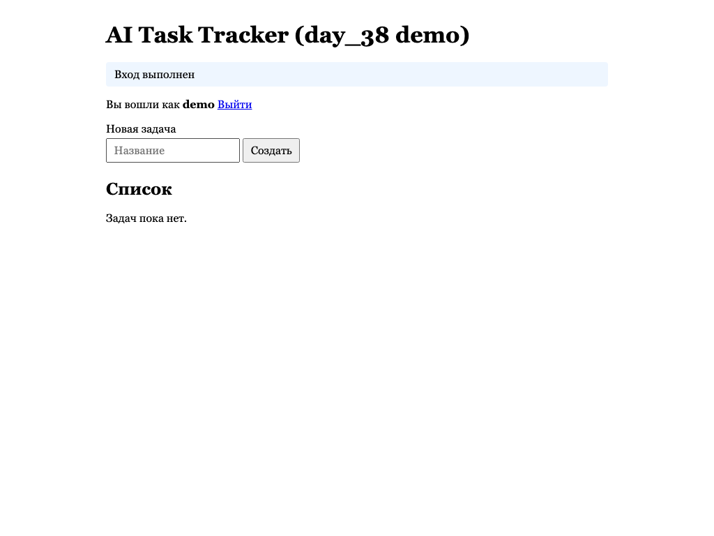
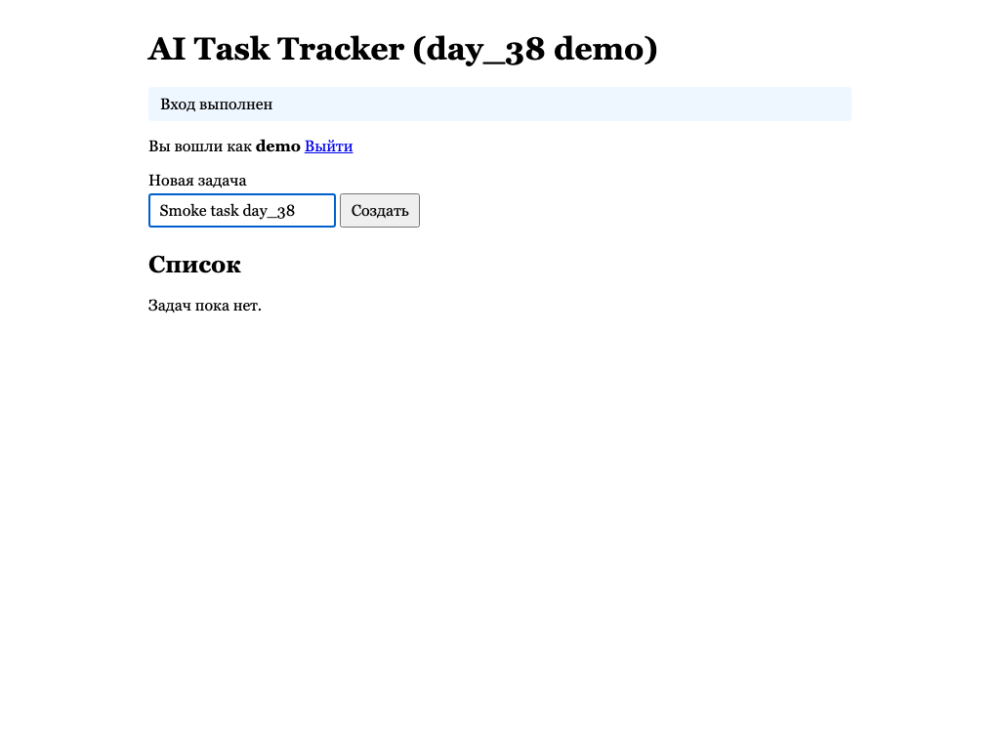
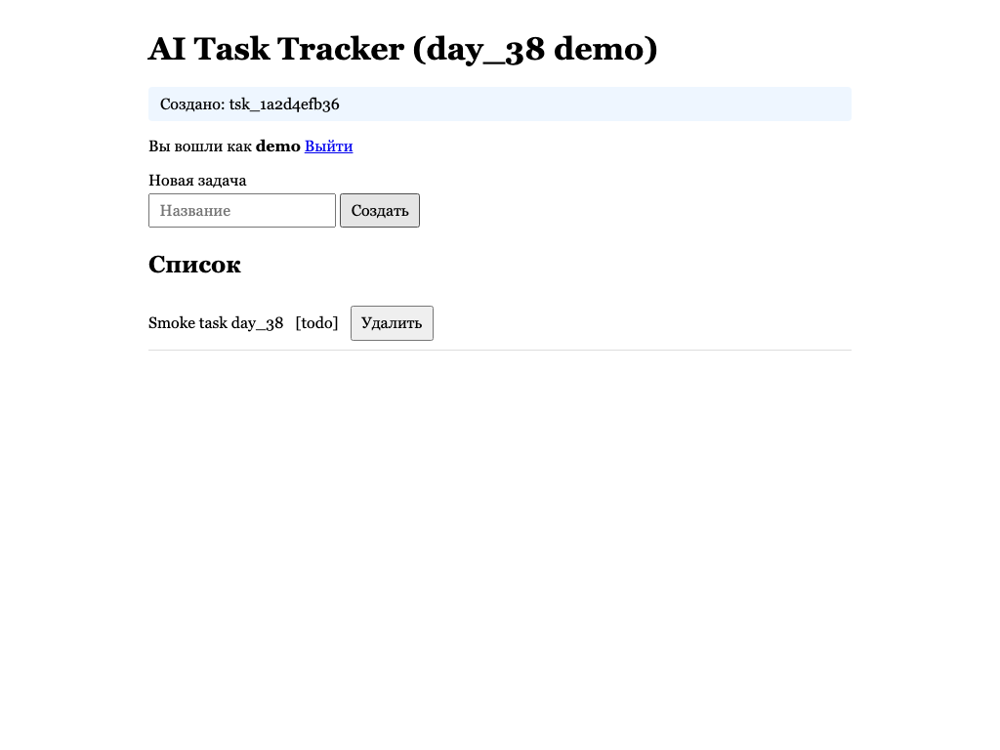
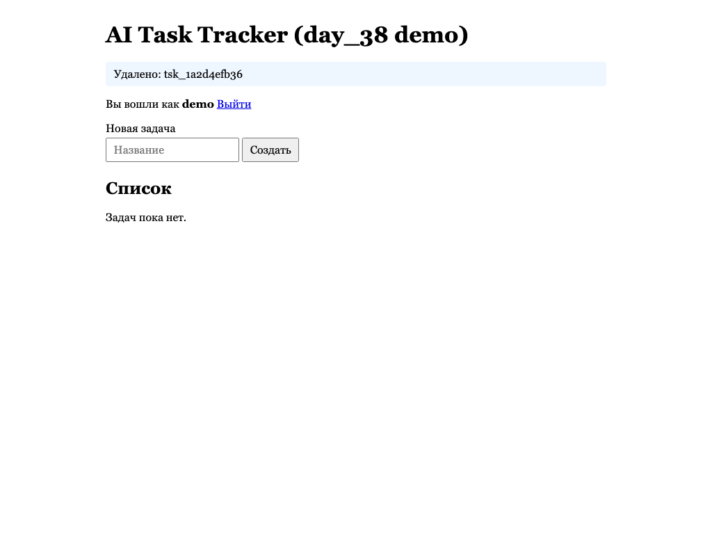
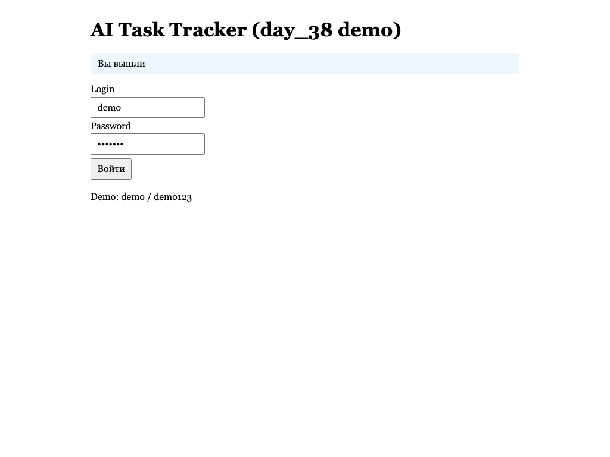
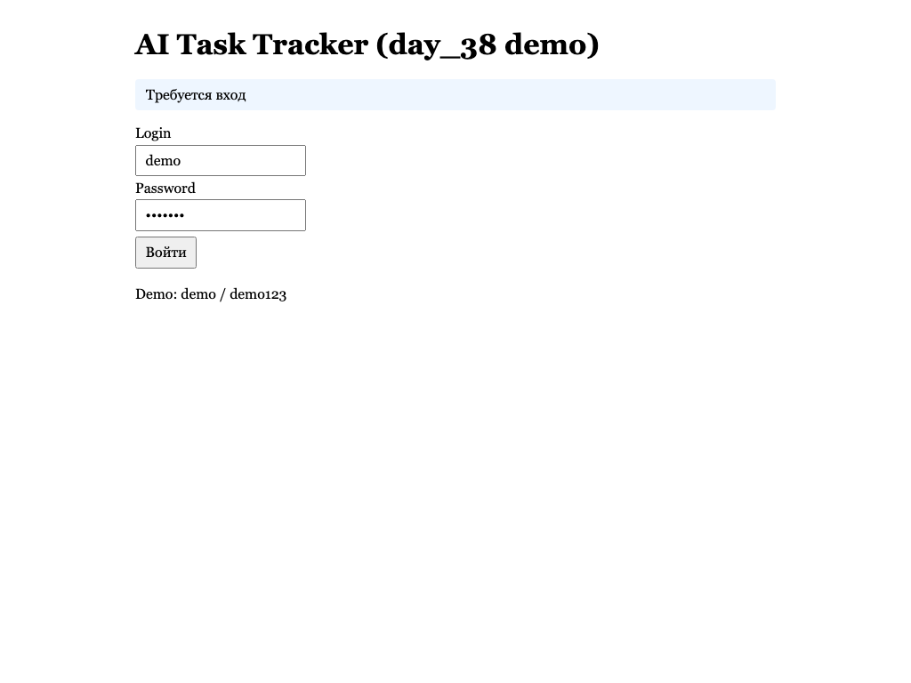

# Day 38 UI smoke report

Generated: `2026-07-23T09:07:06Z`
Base URL: `http://127.0.0.1:8765`
Tooling: Playwright Python (MCP Playwright / Claude in Mobile недоступны в workspace)

**Overall:** PASS

## S1 — Login: PASS
- [ok] open_login: /login opened ([screenshot](s1_01_login_page.png))
  
- [ok] fill_credentials: demo/demo123 ([screenshot](s1_02_login_filled.png))
  
- [ok] submit_login: redirect /tasks ([screenshot](s1_03_logged_in.png))
  

## S2 — Create task: PASS
- [ok] fill_title: Smoke task day_38 ([screenshot](s2_01_create_filled.png))
  
- [ok] submit_create: Создано: tsk_1a2d4efb36 ([screenshot](s2_02_created.png))
  

## S3 — Verify task in list: PASS
- [ok] assert_list: Smoke task day_38
[todo]
Удалить ([screenshot](s3_01_verified.png))
  

## S4 — Delete task: PASS
- [ok] delete: Удалено: tsk_1a2d4efb36 ([screenshot](s4_01_deleted.png))
  

## S5 — Logout: PASS
- [ok] logout: /login ([screenshot](s5_01_logged_out.png))
  
- [ok] protected_tasks: redirect to login ([screenshot](s5_02_protected.png))
  
