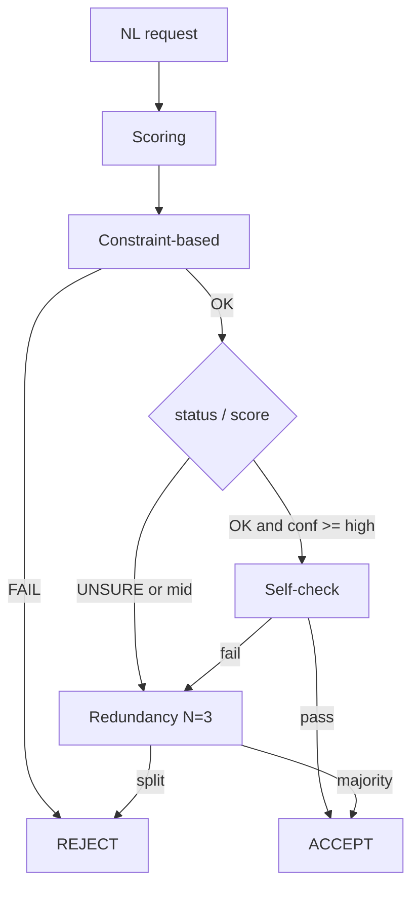

# День 7. Оценка уверенности и контроль качества инференса

Возьмите задачу, где ошибка недопустима (классификация, извлечение данных, решение “да/нет”, выбор действия). Реализуйте механизм оценки уверенности результата, без fine-tuning.

Сделайте минимум 2 разных подхода:

👉 Self-check
• модель объясняет, почему выбрала ответ
• или проверяет свой же результат

👉 Redundancy
• один и тот же запрос выполняется 2–3 раза
• ответы сравниваются между собой

👉 Constraint-based
• проверка формата
• проверка допустимых значений
• логические инварианты

👉 Scoring
• модель возвращает ответ + confidence score
• или статус (OK / UNSURE / FAIL)
(можно выбрать любые 2–3)

Протестируйте:
👉 корректные запросы
👉 пограничные случаи
👉 заведомо сложные или шумные входные данные

Замерьте:
👉 сколько ответов было отклонено
👉 сколько потребовало повторного инференса
👉 влияние на latency и cost

Результат:
Инференс с явной оценкой уверенности и контролем принятия результата

---

## Выбранная задача (ошибка недопустима)

**Классификация действия Todoist-агента** по NL-запросу:

| Action | Смысл | Цена ошибки |
|--------|--------|-------------|
| `create` | создать задачу | шум в трекере |
| `complete` | закрыть задачу | **необратимое** закрытие не той задачи |
| `list` | список задач | низкий риск |
| `refuse` | отказ / уточнение | безопасный fallback |

Выбор действия перед MCP `complete_task` — классический high-stakes gate: лучше reject/refuse, чем ложное закрытие.

## Реализация (все 4 подхода)

Код: [`app/services/confidence_inference_service.py`](../app/services/confidence_inference_service.py)

Пайплайн на каждый запрос:

1. **Scoring** — JSON `{action, confidence, status: OK|UNSURE|FAIL, rationale}`
2. **Constraint-based** — enum action/status, `confidence ∈ [0,1]`, JSON parseable, инвариант: `complete` только при наличии id/имени задачи в тексте
3. **Self-check** — при `OK` и `confidence ≥ 0.85` второй вызов проверяет ответ (`agree` / `corrected_action`)
4. **Redundancy** — при `UNSURE`, mid-confidence (`0.55–0.85`) или провале self-check: 3 независимых scoring + majority vote; ничья → reject

Пороги: `HIGH=0.85`, `MID=0.55`, `N=3`.



## Артефакты и запуск

| Путь | |
|------|--|
| [`homeworks/artifacts/day_42/cases.json`](artifacts/day_42/cases.json) | 12 кейсов: clear / borderline / noisy |
| [`homeworks/artifacts/day_42/results.json`](artifacts/day_42/results.json) | per-case решения |
| [`homeworks/artifacts/day_42/metrics.json`](artifacts/day_42/metrics.json) | агрегаты |
| [`homeworks/src/day_42_run_confidence.py`](src/day_42_run_confidence.py) | бенчмарк |
| [`tests/test_confidence_inference_service.py`](../tests/test_confidence_inference_service.py) | unit без сети |

```bash
source .venv/bin/activate
python -m pytest tests/test_confidence_inference_service.py -q
python homeworks/src/day_42_run_confidence.py --offline   # детерминированный прогон
python homeworks/src/day_42_run_confidence.py             # живой провайдер из .env
```

Живой прогон через `LLM_PROVIDER=cursor` в этой среде упал с `Cursor agent request failed: internal error`. Отчёт ниже — по `--offline` (скриптованный провайдер с теми же путями gate: scoring → constraint → self-check/redundancy), плюс unit-тесты на mock.

## Прогон: метрики

Источник: `artifacts/day_42/metrics.json` (mode=`offline`, 12 кейсов).

| Метрика | Значение |
|---------|----------|
| Отклонено (rejected) | **2 / 12** (16.7%) |
| Принято (accepted) | 10 / 12 |
| Повторных инференсов (`re_inference`) | **25** всего, ~2.08 / кейс |
| LLM calls | 37 всего, ~3.08 / кейс |
| Baseline latency (только 1-й Scoring) | 0.24 s total / 0.02 s avg |
| Full gate latency | 0.74 s total / 0.062 s avg |
| Overhead latency | **+0.50 s** (~**3.08×** к baseline) |
| Cost proxy (prompt+completion tokens) | **2220** (~185 / кейс; baseline был бы ~60 / кейс → ~**3.1×** cost) |

По категориям:

| Категория | Кейсы | Rejected | Re-inference | Latency |
|-----------|-------|----------|--------------|---------|
| clear | 4 | 0 | 4 (self-check) | 0.16 s |
| borderline | 4 | 1 | 9 | 0.26 s |
| noisy | 4 | 1 | 12 | 0.32 s |

### Отклонённые

1. `border_vague_complete` («можно закрыть что-нибудь?») — **Constraint**: `complete_without_task_reference` (без лишних LLM-вызовов).
2. `noisy_garbage` (`asdf qwerty`) — **Redundancy**: нет majority → reject.

### Пути принятия

- Clear → Scoring + Constraint + Self-check (2 LLM call).
- Border/noisy (кроме reject) → Scoring + Constraint + Redundancy ×3 (4 LLM call).

## Выводы

- Все четыре подхода работают в одном gate: scoring даёт сигнал, constraints отсекают опасный `complete`, self-check страхует high-confidence, redundancy разрешает ambiguous/noisy.
- Цена контроля: ~**3× latency и tokens** относительно одного scoring-вызова; rejected 2/12 на намеренно сложных кейсах.
- Для продакшена Todoist-gateway: reject/`refuse` предпочтительнее ложного `complete`.
