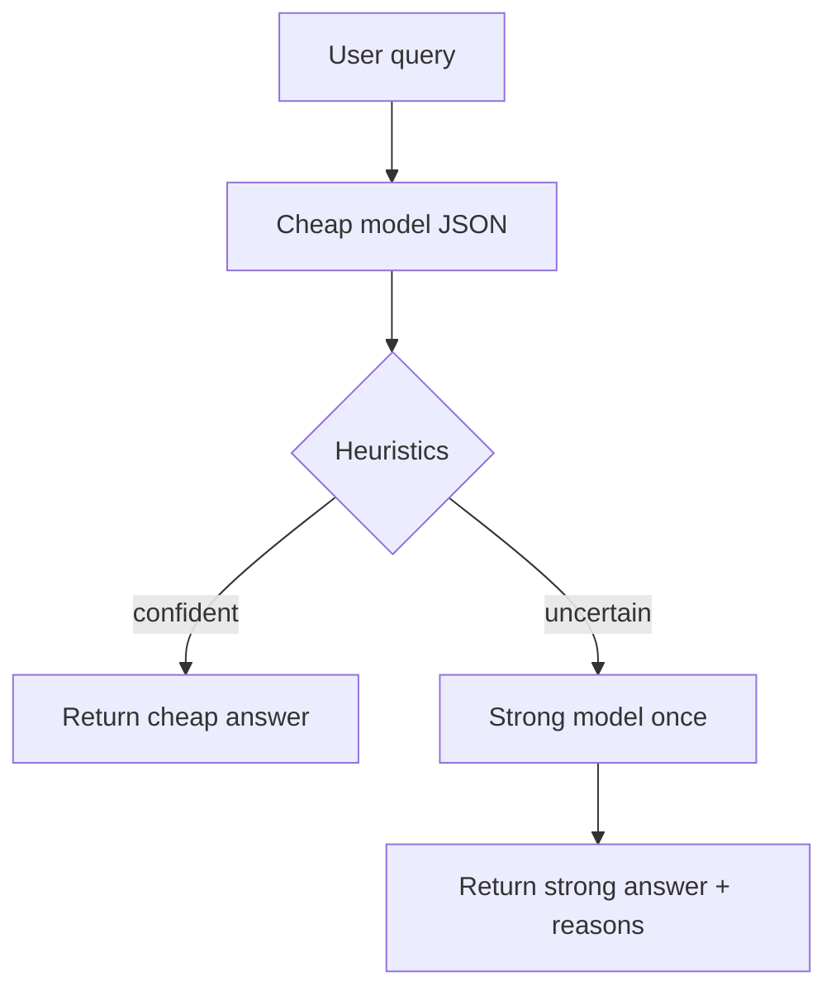

# 🔥 День 8. Routing между моделями

Реализуйте routing запросов между моделями.

Пример стратегии:
👉 сначала дешёвая / быстрая модель
👉 если результат неуверенный — более сильная модель

Сделайте минимум одну эвристику:
👉 длина ответа
👉 confidence score
👉 правило “если не уверен — эскалируй”

Протестируйте на серии запросов:
👉 какие запросы остались на маленькой модели
👉 какие ушли на большую

Результат:
Рабочий routing между моделями с fallback-логикой

---

## Реализация

Код: [`app/services/model_routing_service.py`](../app/services/model_routing_service.py)

Поток:

1. Запрос идёт на **cheap** модель с JSON `{answer, confidence, status}`.
2. Эвристики решают, эскалировать ли на **strong**:
   - `empty_answer` / `short_answer` (короткий ответ без высокого OK-confidence)
   - `low_confidence` (`confidence < LLM_ROUTE_CONFIDENCE_MIN`, default `0.55`)
   - `status_unsure` / `status_fail`
   - `uncertain_markers` («не уверен», `I don't know`, …)
   - `truncated` (`finish_reason=length`)
3. При эскалации — один вызов strong с контекстом исходного вопроса и cheap-ответа.

`ProviderService.complete(..., model_candidates=[...])` позволяет выбрать модель на вызов (без путаницы с availability-fallback `LLM_FALLBACK_MODELS`).

Конфиг: `LLM_CHEAP_MODEL` / `LLM_STRONG_MODEL` через `get_routing_models()` в [`app/config.py`](../app/config.py).

| Провайдер | Cheap (default) | Strong (default) |
|-----------|-----------------|------------------|
| **cursor** | `composer-2` | `composer-2.5` |
| ollama | `qwen2.5-coder:1.5b` | `qwen2.5-coder:7b` |
| groq | `llama-3.1-8b-instant` | `llama-3.3-70b-versatile` |
| openrouter | `google/gemini-2.5-flash-lite` | `qwen/qwen-2.5-72b-instruct` |



## Запуск

```bash
# unit
.venv/bin/python -m pytest tests/test_model_routing_service.py -q

# offline (scripted)
.venv/bin/python homeworks/src/day_43_run_routing.py --mode offline

# live Cursor (предпочтительно для ДЗ)
.venv/bin/python homeworks/src/day_43_run_routing.py --mode live --provider cursor

# live Ollama (CPU: OLLAMA_NUM_GPU=0 ollama serve)
.venv/bin/python homeworks/src/day_43_run_routing.py --mode live --provider ollama
```

Артефакты: [`homeworks/artifacts/day_43/`](artifacts/day_43/)

| Файл | Содержимое |
|------|------------|
| `cases.json` | 8 запросов: easy / ambiguous / hard |
| `results_offline.json` / `metrics_offline.json` | детерминированный прогон |
| `results_cursor.json` / `metrics_cursor.json` | live `composer-2` → `composer-2.5` |
| `results_ollama.json` / `metrics_ollama.json` | live `1.5b` → `3b` (подмножество) |

## Результаты live (Cursor)

Пара: **cheap=`composer-2`**, **strong=`composer-2.5`**.

| Остались на cheap | Ушли на strong | Почему |
|-------------------|----------------|--------|
| `easy_capitals`, `easy_definition`, `hard_tradeoff` | | высокая confidence / OK |
| | `easy_math` | `short_answer` (ответ «51»; после уточнения эвристики короткий OK+high conf больше не эскалирует) |
| | `ambiguous_pronoun`, `underspecified_plan`, `noisy_mixed`, `hard_legalish` | `status_unsure` + `low_confidence` (± markers) |

Метрики Cursor (8 кейсов): `stayed_cheap=3`, `escalated_strong=5`, `avg_llm_calls=1.625`.

Замечание: первый вызов Cursor иногда падает bridge (`Missing --tool-callback-auth-token`); повтор стабилен. Переключение моделей через SDK работает.

## Результаты live (Ollama)

После Metal OOM (конфликт GPU с Cursor) сервер поднят с `OLLAMA_NUM_GPU=0`. Пара `1.5b` → `3b`, 4 кейса: 2 stayed / 2 escalated (`short_answer` на коротких JSON-ответах без стабильного high-conf OK).

## Тесты

`tests/test_model_routing_service.py` — эвристики + stay/escalate без сети.
