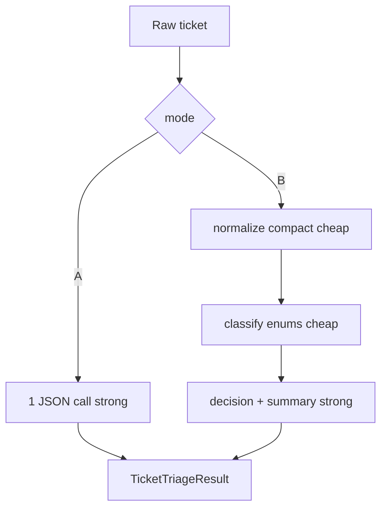

# День 9. Декомпозиция инференса (multi-stage inference)

Возьмите задачу, которая плохо решается одним запросом:
👉 сложная классификация 
👉 извлечение нескольких полей 
👉 принятие решения на основе условий

Реализуйте декомпозицию инференса:
👉 Вариант A: monolithic
• один большой запрос
• один ответ

👉 Вариант B: multi-stage
• этап 1: анализ / нормализация входа
• этап 2: принятие решения / классификация
• этап 3: формирование результата

Важно:
👉 каждый этап — короткий и дешёвый запрос
👉 можно использовать разные модели 
👉 формат каждого этапа — строгий (enum / TOON / compact)

---

## Выбранная задача

**Триаж тикета поддержки** по сырому NL-тексту (шум, опечатки, RU/EN):

| Поле | Enum / формат |
|------|----------------|
| `intent` | `billing` \| `bug` \| `access` \| `feature` \| `spam` \| `other` |
| `urgency` | `low` \| `medium` \| `high` \| `critical` |
| `product` | `payments` \| `auth` \| `api` \| `web` \| `mobile` \| `unknown` |
| `decision` | `auto_reply` \| `queue` \| `escalate` \| `reject` |
| `summary` | одна короткая фраза для оператора |

Правила decision: `spam` → `reject`; `critical`+`bug` → `escalate`; `high`/`critical` → `escalate`; низкий billing/feature FAQ → `auto_reply`; иначе `queue`.

## Реализация

Код: [`app/services/multistage_inference_service.py`](../app/services/multistage_inference_service.py)

| Режим | Вызовы | Модели | Формат |
|-------|--------|--------|--------|
| **A monolithic** | 1 | strong | один JSON со всеми полями |
| **B multi-stage** | 3 | cheap → cheap → strong | compact `k=v;...` на этапах 1–3 |



Модели: `LLM_CHEAP_MODEL` / `LLM_STRONG_MODEL` через `get_routing_models()` (как day_43).

## Демо (воспроизводимый пример)

Пример сырого тикета (`bug_critical_noisy` из [`cases.json`](artifacts/day_44/cases.json)):

```text
URGENT!!! api /v2/checkout keeps returning HTTP 500 since 03:00 UTC — production is DOWN plz escalate ASAP!!!!!!
```

Ожидаемый результат:

```json
{
  "intent": "bug",
  "urgency": "critical",
  "product": "api",
  "decision": "escalate",
  "summary": "..."
}
```

### Команды

Из корня репозитория:

```bash
# unit-тесты (без сети / без LLM)
.venv/bin/python -m pytest tests/test_multistage_inference_service.py -q

# offline: оба варианта A+B на всех 8 кейсах (детерминированный Fake)
.venv/bin/python homeworks/src/day_44_run_multistage.py --mode offline

# один кейс, только multi-stage
.venv/bin/python homeworks/src/day_44_run_multistage.py --mode offline \
  --variant multistage --case-id bug_critical_noisy

# только monolithic
.venv/bin/python homeworks/src/day_44_run_multistage.py --mode offline \
  --variant monolithic --case-id billing_clear

# live Cursor (cheap/strong из get_routing_models)
.venv/bin/python homeworks/src/day_44_run_multistage.py --mode live --provider cursor

# live Ollama
.venv/bin/python homeworks/src/day_44_run_multistage.py --mode live --provider ollama
```

Артефакты: [`homeworks/artifacts/day_44/`](artifacts/day_44/)

| Файл | Содержимое |
|------|------------|
| `cases.json` | 8 тикетов: clear / noisy / spam / ambiguous / mixed / high_risk |
| `results_offline.json` / `metrics_offline.json` | прогон A+B offline |
| `results_*.json` / `metrics_*.json` | live при `--mode live` |

### Offline-метрики (эталон)

После `--mode offline`: monolithic `avg_llm_calls=1`, multistage `avg_llm_calls=3`, согласие A↔B по intent/decision = 1.0 на 8 кейсах.

## Тесты

`tests/test_multistage_inference_service.py` — parsers, enum/decision rules, 1 vs 3 вызова Fake provider.
