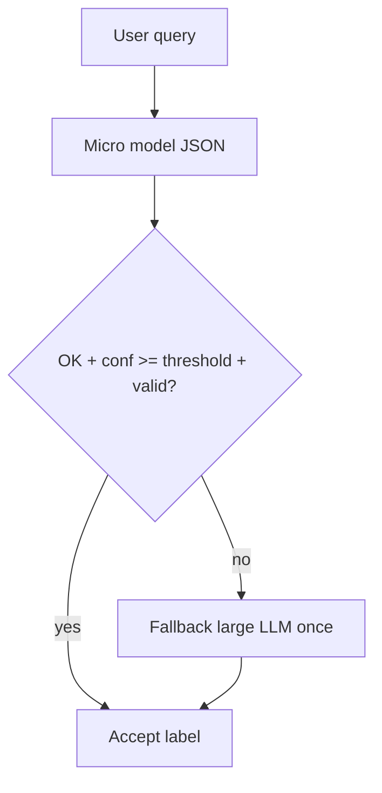

# 🔥 День 10. Micro-model first: проверка перед LLM

Возьмите задачу, где LLM обычно используется по умолчанию, но в реальности большинство кейсов можно обработать проще.

Примеры задач (выберите одну):
👉 классификация запроса
👉 определение интента
👉 принятие решения (enum / action)
👉 извлечение простых данных

Реализуйте двухуровневый инференс
🔹 Уровень 1 — Micro-model (обязательный)

Используйте:
👉 маленькую LLM
👉 либо embedding-based классификацию
👉 либо простой ML-классификатор

Micro-model должна:
👉 вернуть структурированный результат (enum / label / score)
👉 вернуть статус уверенности (OK / UNSURE или confidence score)

🔹 Уровень 2 — LLM fallback

Используйте большую модель только если:
👉 micro-model вернула UNSURE
👉 confidence ниже порога
👉 формат ответа некорректен

Протестируйте систему

Прогоните минимум 20–30 запросов:
👉 простые
👉 пограничные
👉 сложные

Замерьте:
👉 сколько запросов обработала micro-model
👉 сколько ушло в fallback
👉 общее количество вызовов большой LLM
👉 среднюю latency

Результат:
Инференс-пайплайн, где micro-model отсекает большинство запросов до вызова большой LLM

Формат:
Видео + Код

---

## Выбранная задача

**Классификация запроса** для LLM CLI-агента. Labels:

| Label | Смысл |
|-------|--------|
| `faq` | короткий фактоид / howto |
| `code_help` | код, debug, рефакторинг, review |
| `action` | создать/закрыть/список задач, tool |
| `rag` | вопрос по docs/кодовой базе репо |
| `chitchat` | привет / thanks / small talk |
| `other` | остальное |

Micro JSON:

```json
{"label":"faq|code_help|action|rag|chitchat|other","confidence":0.0,"status":"OK"|"UNSURE"|"FAIL"}
```

Fallback (большая модель) только при `UNSURE`/`FAIL`, `confidence < LLM_ROUTE_CONFIDENCE_MIN` (default `0.6`) или битом формате/label.

## Реализация

Код: [`app/services/micro_model_first_service.py`](../app/services/micro_model_first_service.py)



| Уровень | Роль | Cursor default | Ollama default |
|---------|------|----------------|----------------|
| Micro | обязательный классификатор | `composer-2` | `qwen2.5-coder:1.5b` |
| Fallback | только при неуверенности | `composer-2.5` | `qwen2.5-coder:7b` |

Модели через `get_routing_models()` / env `LLM_CHEAP_MODEL` + `LLM_STRONG_MODEL` (как day_43).

**Cursor API:** `cursor-sdk` принимает `model=` на каждый вызов (`Agent.prompt` / `ProviderService.complete(..., model_candidates=[...])`). Разделение micro/fallback на двух облачных моделях работает — локальная Ollama для micro **не обязательна**. Ollama оставлена как альтернатива / hybrid.

## Запуск Ollama (если нужна локальная micro)

```bash
# macOS: приложение Ollama или:
curl -fsSL https://ollama.com/install.sh | sh
ollama serve

# при конфликте GPU с Cursor IDE:
OLLAMA_NUM_GPU=0 ollama serve

ollama pull qwen2.5-coder:1.5b
ollama pull qwen2.5-coder:7b   # если fallback тоже на Ollama
ollama list
```

Проверка API:

```bash
curl -s http://127.0.0.1:11434/api/tags | head
```

## Демо / команды

```bash
# unit (без сети)
.venv/bin/python -m pytest tests/test_micro_model_first_service.py -q

# offline: 30 кейсов, детерминированный Fake
.venv/bin/python homeworks/src/day_45_run_micro_first.py --mode offline

# live Cursor: micro=composer-2, fallback=composer-2.5
.venv/bin/python homeworks/src/day_45_run_micro_first.py --mode live --provider cursor

# live Ollama (оба уровня локально)
.venv/bin/python homeworks/src/day_45_run_micro_first.py --mode live --provider ollama

# hybrid: micro=Ollama, fallback=Cursor
.venv/bin/python homeworks/src/day_45_run_micro_first.py --mode live --provider hybrid
```

Артефакты: [`homeworks/artifacts/day_45/`](artifacts/day_45/)

| Файл | Содержимое |
|------|------------|
| `cases.json` | 30 запросов: simple / borderline / complex |
| `results_offline.json` / `metrics_offline.json` | Fake-прогон |
| `results_cursor.json` / `metrics_cursor.json` | live Cursor |

## Результаты live (Cursor)

Пара: **micro=`composer-2`**, **fallback=`composer-2.5`**, порог confidence `0.6`, **30 кейсов**.

| Метрика | Значение |
|---------|----------|
| Обработала micro | **25** |
| Ушло в fallback | **5** |
| Вызовов большой LLM | **5** |
| `avg_llm_calls` | **1.167** |
| `avg_latency_sec` | **~5.87** |
| `label_accuracy` vs expect | **0.80** |

Fallback-кейсы (причины `status_unsure` + `low_confidence`):

- `border_mixed_short` («fix it»)
- `complex_mixed` (привет + task + RAG в одном)
- `complex_ambiguous_pronoun` («same as last time»)
- `complex_multi_intent` (search + tests + hi)
- `border_emptyish` («... ???»)

Вывод: micro-model отсекает большинство запросов; большая модель вызывается только на реально неоднозначных входах.

## Offline-эталон

После `--mode offline`: `handled_by_micro=17`, `escalated_fallback=13`, `avg_llm_calls=1.433`, `label_accuracy=1.0`.

## Тесты

`tests/test_micro_model_first_service.py` — parse/validate, accept micro, escalate на UNSURE и invalid format.
