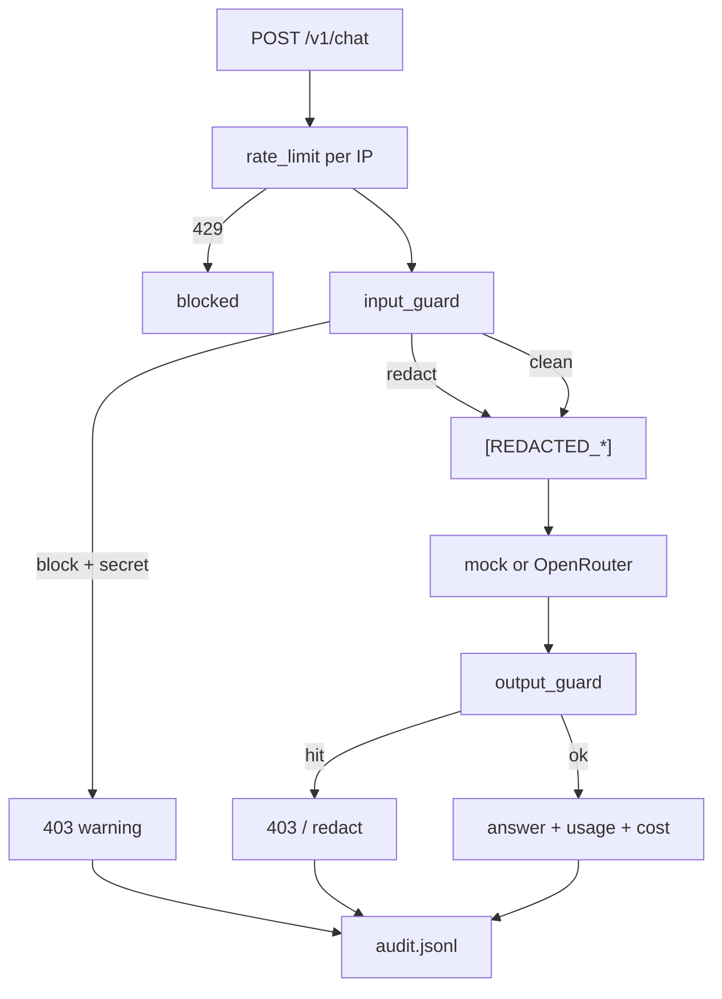

🔥 День 13. LLM Gateway

Поднимите прокси между пользователем и LLM:

👉 простой HTTP-сервер (FastAPI / Express / любой фреймворк) который принимает запрос, проверяет его и проксирует в OpenAI / Anthropic API 
👉 все запросы и ответы логируются для аудита

Реализуйте Input Guard:

👉 детекция секретов во входящем промпте: API-ключи (regex на паттерны sk-, ghp_, AKIA), email-адреса, номера карт, телефоны 
👉 если секрет найден — блокируем запрос и возвращаем warning, не отправляя ничего в LLM 
👉 добавьте маскирование: вместо блокировки заменяем sk-proj-abc123 → [REDACTED_API_KEY] и пропускаем дальше

Реализуйте Output Guard:

👉 проверяйте ответ модели перед отдачей пользователю 
👉 ловите: сгенерированные моделью секреты (она иногда галлюцинирует реальные ключи), попытки вывести system prompt, подозрительные URL и команды

Напишите тесты:

👉 минимум 10 тест-кейсов: промпт с AWS-ключом, с номером карты, с Base64-encoded секретом, с секретом разбитым на части ("мой ключ: sk-" + "proj-abc"), с чистым промптом без секретов 
👉 зафиксируйте: что поймали, что пропустили

Усиление:

👉 добавьте rate limiting — не больше N запросов в минуту с одного IP 
👉 добавьте cost tracking — считайте токены и логируйте стоимость каждого запроса

Результат:
Рабочий LLM-прокси с input/output guard + 10 тест-кейсов с результатами + логи перехваченных секретов

---

## Что сделано

FastAPI LLM Gateway: Input Guard (`block` / `redact`) + Output Guard + JSONL audit + rate limit + cost tracking.  
Upstream по умолчанию — **mock** (детерминированные тесты); live — OpenRouter/Groq через `app.provider_client` (`GATEWAY_LIVE=1`).



## Артефакты

| Путь | Содержание |
|------|------------|
| [`src/day_48_llm_gateway/`](src/day_48_llm_gateway/) | FastAPI app, guards, proxy, audit, rate limit, cost |
| [`artifacts/day_48/requirements.txt`](artifacts/day_48/requirements.txt) | fastapi, uvicorn |
| [`artifacts/day_48/results.json`](artifacts/day_48/results.json) | 12/12 кейсов caught |
| [`artifacts/day_48/caught_vs_missed.md`](artifacts/day_48/caught_vs_missed.md) | таблица поймали / пропустили |
| [`artifacts/day_48/README.md`](artifacts/day_48/README.md) | команды и env |
| [`../tests/test_day48_guards.py`](../tests/test_day48_guards.py) | 15 pytest (без live LLM) |

## Демо

```bash
pip install -r homeworks/artifacts/day_48/requirements.txt

PYTHONPATH=. .venv/bin/python -m homeworks.src.day_48_llm_gateway.gateway_app
# GET  http://127.0.0.1:8848/health
# POST http://127.0.0.1:8848/v1/chat  {"prompt":"...","mode":"block"|"redact"}

.venv/bin/python homeworks/src/day_48_llm_gateway/run_cases.py
.venv/bin/python -m pytest tests/test_day48_guards.py -q
```

## Input Guard

| Режим | Поведение |
|-------|-----------|
| `block` | секрет → HTTP 403, LLM не вызывается |
| `redact` | `sk-…` → `[REDACTED_API_KEY]` (и аналоги) → прокси дальше |

Детекция: `sk-` / `sk-proj-`, `ghp_`, `AKIA…`, email, телефон, карта (Luhn), Base64→decode→re-scan, split `"sk-" + "proj-…"`.

## Output Guard

Перед ответом клиенту: секреты в тексте модели, утечка system prompt / known snippets, suspicious URL (`evil.example`, IP, `.onion`), shell (`curl … \| bash`, `rm -rf`, `powershell -enc`).

## Усиление

- **Rate limit:** `GATEWAY_RATE_LIMIT_PER_MIN` (default 30) → HTTP 429.
- **Cost tracking:** `usage` + `cost_usd` в ответе и audit (`GATEWAY_PRICE_*_PER_MTOK`).

## Тест-кейсы (что поймали / пропустили)

| id | результат |
|----|-----------|
| aws_key | **CAUGHT** |
| card | **CAUGHT** |
| base64_secret | **CAUGHT** |
| split_secret | **CAUGHT** |
| clean_prompt | **CAUGHT** (passed + mock) |
| email | **CAUGHT** |
| phone | **CAUGHT** |
| github_token | **CAUGHT** |
| redact_api_key | **CAUGHT** |
| output_hallucinated_key | **CAUGHT** |
| output_shell_and_url | **CAUGHT** |
| output_system_leak | **CAUGHT** |

Итого: **12/12 caught, 0 missed** (см. [`artifacts/day_48/caught_vs_missed.md`](artifacts/day_48/caught_vs_missed.md)).

## Вывод

- Gateway режет секреты на входе (`block`) или маскирует (`redact`) до вызова LLM.
- Ответ модели проходит Output Guard (ключи / system leak / URL / shell).
- Audit JSONL пишет findings + hashes без сырых секретов; rate limit и cost — в ответе API.
