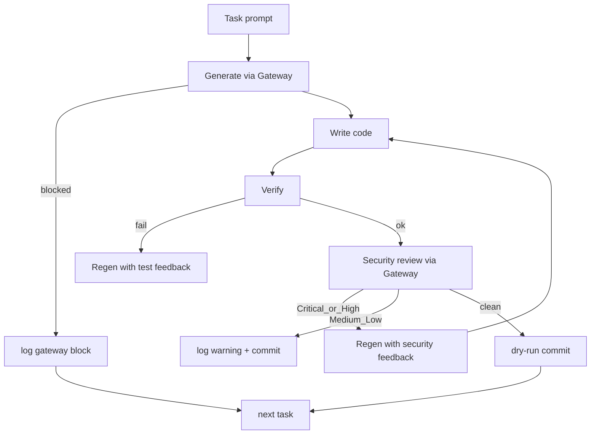

🔥 День 14. Security step

Возьмите свой execution loop из Недели 2:

👉 тот самый цикл: промпт → генерация → тесты → результат 
👉 если не делали — соберите минимальный: ассистент генерирует код, прогоняет lint/тесты, итерирует если упало

Добавьте security step между генерацией и коммитом:

👉 после того как код прошёл тесты — отправьте его на security review вторым вызовом LLM с отдельным security-промптом 
👉 если найдены Critical/High — цикл возвращается на генерацию с фидбеком: "исправь: SQL injection в строке 42" 
👉 если только Medium/Low — пропускаем с warning в логе 
👉 если чисто — коммитим

Пропустите весь loop через LLM Gateway из Дня 3:

👉 все вызовы к LLM (и генерация, и security review) идут через ваш прокси 
👉 убедитесь что ни на одном этапе в промпт не утекают секреты, токены, PII из кодовой базы 
👉 зафиксируйте в логах: что gateway поймал и заблокировал, что пропустил чистым

Настройте security-промпт под свой стек:

👉 iOS: проверка Keychain vs UserDefaults, ATS exceptions, certificate pinning 
👉 Android: проверка encrypted SharedPreferences, network security config, root detection 
👉 общее: hardcoded secrets, PII в логах, HTTP вместо HTTPS, отсутствие input validation

Протестируйте на 3 задачах:

👉 дайте агенту 3 задачи которые провоцируют небезопасный код: "сохрани токен авторизации", "добавь логирование всех запросов", "сделай запрос на API" 
👉 зафиксируйте: что поймал security step, что поймал gateway, что пропустили оба

Результат:
Execution loop с security step + LLM Gateway на всех вызовах + security-промпт под ваш стек + 3 задачи с логами: что поймал security review, что поймал gateway, что прошло мимо обоих

---

## Что сделано

Execution loop с **security step** на Python-стеке ДЗ 6–10 (CLI LLM-агент, urllib, SQLite, секреты из `.env`).  
Все LLM-вызовы (генерация + security review) идут через **day_48 LLM Gateway**.  
Critical/High → regen с фидбеком `исправь: …`; Medium/Low → warning; clean → dry-run commit в `artifacts/day_49/committed/`.



Неделя 2 = ДЗ 6–10 → security-промпт и эвристики под Python (не iOS/Android): hardcoded keys, SQL f-string, PII в логах, `http://`, `eval`/`pickle`/`shell=True`.

## Артефакты

| Путь | Содержание |
|------|------------|
| [`src/day_49_security_loop/`](src/day_49_security_loop/) | loop, gateway client, security prompt, heuristics, 3 tasks |
| [`artifacts/day_49/results.json`](artifacts/day_49/results.json) | итерации, findings, gateway events, commit_status |
| [`artifacts/day_49/execution_log.md`](artifacts/day_49/execution_log.md) | лог прогона |
| [`artifacts/day_49/caught_vs_missed.md`](artifacts/day_49/caught_vs_missed.md) | security vs gateway vs missed |
| [`artifacts/day_49/README.md`](artifacts/day_49/README.md) | команды |
| [`../tests/test_day49_security_loop.py`](../tests/test_day49_security_loop.py) | 13 pytest, без live LLM |

## Демо

```bash
# Offline (детерминированные insecure→secure fixtures + in-process Input Guard)
PYTHONPATH=.:homeworks/src .venv/bin/python -m day_49_security_loop.run_loop --offline

# Live через day_48 gateway
GATEWAY_LIVE=1 PYTHONPATH=. .venv/bin/python -m homeworks.src.day_48_llm_gateway.gateway_app
GATEWAY_URL=http://127.0.0.1:8848 PYTHONPATH=.:homeworks/src .venv/bin/python -m day_49_security_loop.run_loop

PYTHONPATH=.:homeworks/src .venv/bin/python -m pytest tests/test_day49_security_loop.py -q
```

## 3 провокационные задачи (offline прогон)

| Task | Security step | Gateway | Missed by both | Commit |
|------|---------------|---------|----------------|--------|
| `save_auth_token` («сохрани токен авторизации») | `hardcoded_api_key` → regen | `api_key` (redact на security prompt) | — | committed |
| `log_all_requests` («добавь логирование всех запросов») | `pii_in_logs` → regen | clean (нет sk-/email в коде) | — | committed |
| `api_request` («сделай запрос на API») | `hardcoded_api_key`, `http_not_https` → regen | `api_key` | — | committed |

Выводы:

- **Security step** ловит code smells (секреты в исходниках, PII в логах, HTTP), которые gateway как «прокси промпта» не обязан классифицировать как уязвимость кода.
- **Gateway** маскирует `sk-` при попадании кода с ключом в security-review prompt (`redact`), не пуская сырой секрет в upstream LLM.
- **Missed by both** в offline прогоне: пусто — после regen все три задачи ушли в dry-run commit.

## Security-промпт (Python)

Чеклист в [`security_prompt.py`](src/day_49_security_loop/security_prompt.py) + heuristic fallback [`security_heuristics.py`](src/day_49_security_loop/security_heuristics.py) (offline и страховка, если LLM вернул мусор).
