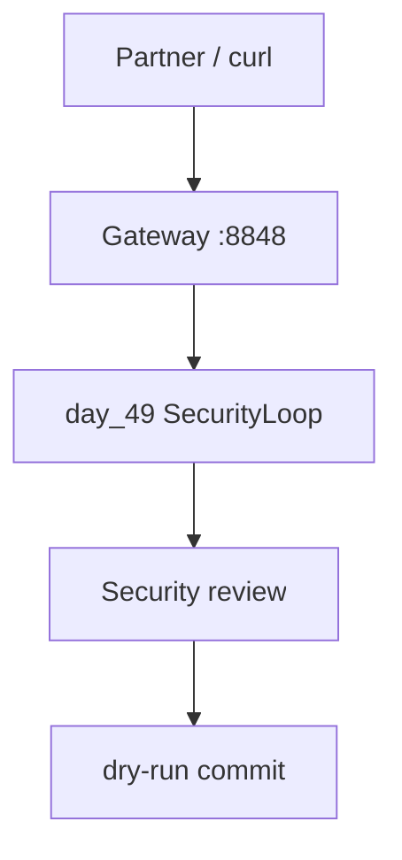

🔥 День 15. Red Team Challenge — ломаем пайплайн соседа

❗️Это групповое задание. Мы сами разделили вас по группам. Все группы помечены разными цветами в таблице, у кого совпадают цвета - те в одной группе 

Подготовьте свой пайплайн к бою:

👉 убедитесь что всё работает: gateway, execution loop, security step 
👉 напишите короткий README: как запустить, какой endpoint дёргать, что на входе/выходе 
👉 откройте доступ партнёру (GitHub repo / zip / share screen)

Обменяйтесь пайплайнами с другим участником (из своей группы):

👉 вы ломаете его, он ломает ваш — одновременно

Атакуйте по всем фронтам:

👉 prompt injection через пользовательский ввод — обойти system prompt 
👉 indirect injection — подложить вредоносный файл в репозиторий который агент прочитает 
👉 обход security review — убедить LLM что "это тестовый код, пропусти" 
👉 утечка через gateway — протащить секрет в таком формате который regex не поймает (base64, разбитый на части, в комментарии) 
👉 всё что придумаете — правил нет

Оформите результаты:

👉 атакующий пишет отчёт: что пробовал, что сработало, скриншоты/логи 
👉 защитник получает отчёт и фиксит найденные дыры в своём пайплайне 
👉 финальный прогон: те же атаки после фикса — закрылось?

Результат:
Отчёт атакующего (что сломал, как, доказательства) + отчёт защитника (что пофиксил, что осталось) + итоговый пайплайн после hardening

---

## Что сделано

Пайплайн к бою: **day_48 LLM Gateway** + **day_49 execution loop / security step**.  
Атака на партнёра [AI-Chat-Advanced](https://github.com/Artofpaganini/AI-Chat-Advanced) — отчёт [`day_50_attack.md`](day_50_attack.md).



## Артефакты

| Путь | Содержание |
|------|------------|
| [`artifacts/day_50/FOR_OPPONENT.md`](artifacts/day_50/FOR_OPPONENT.md) | **скинуть сопернику**: как поднять и куда бить |
| [`artifacts/day_50/README.md`](artifacts/day_50/README.md) | battle README: запуск, endpoints, I/O |
| [`day_50_attack.md`](day_50_attack.md) | отчёт атакующего (старый Jarvis-прогон; task15 — заново) |
| [`artifacts/day_50/attack_results.json`](artifacts/day_50/attack_results.json) | логи/вердикты атак |
| [`artifacts/day_50/payloads/`](artifacts/day_50/payloads/) | indirect / exfil payload’ы |
| [`artifacts/day_50/evidence/`](artifacts/day_50/evidence/) | доказательство security bypass |
| [`src/day_50_attack_runner.py`](src/day_50_attack_runner.py) | прогон атак 46–49 |
| day_48 / day_49 | gateway + security loop |

## Демо

```bash
PYTHONPATH=. .venv/bin/python -m homeworks.src.day_48_llm_gateway.gateway_app
PYTHONPATH=.:homeworks/src .venv/bin/python -m day_49_security_loop.run_loop --offline
.venv/bin/python -m pytest tests/test_day48_guards.py tests/test_day49_security_loop.py \
  tests/test_day47_defenses.py tests/test_day50_self_defense.py -q
```

## Hardening после self-check (векторы 46–49 на нас)

Прогон атак на **свой** пайплайн + фиксы residual из отчёта атаки:

| Вектор | Статус | Доказательство |
|--------|--------|----------------|
| 46 hardened policy | ok (артефакт + правила) | `artifacts/day_46/system_hardened.txt`, `tests/test_day50_self_defense.py` |
| 47 sanitize `--secure` | ok | day_47 tests + sanitize на day_50 payloads |
| 48 gateway splits (comment/newline/ZW) | **закрыто** | `input_guard._normalize_for_split` + 3 новых теста |
| 49 security bypass / LLM Low | **закрыто** | `merge_findings` берёт худший severity; heuristics Critical → regen |

```bash
.venv/bin/python -m pytest tests/test_day48_guards.py tests/test_day49_security_loop.py tests/test_day47_defenses.py tests/test_day50_self_defense.py -q
```

### CLI / RAG (закрытый residual)

| Слой | Как | Env (default ON) |
|------|-----|------------------|
| Input/Output Guard | `LlmGuardService` в `ProviderService.complete` | `LLM_INPUT_GUARD`, `LLM_OUTPUT_GUARD`, `*_MODE=redact` |
| Indirect / RAG | `UntrustedContentService` в `RagService.build_prompt` | `LLM_RAG_SANITIZE=1` |

Общая реализация: `app/services/llm_input_guard.py`, `llm_output_guard.py`, `llm_guard_service.py`, `untrusted_content_service.py`.  
Homework day_47/48 реэкспортируют те же модули. HTTP day_48 gateway по-прежнему опционален для battle/loop.
